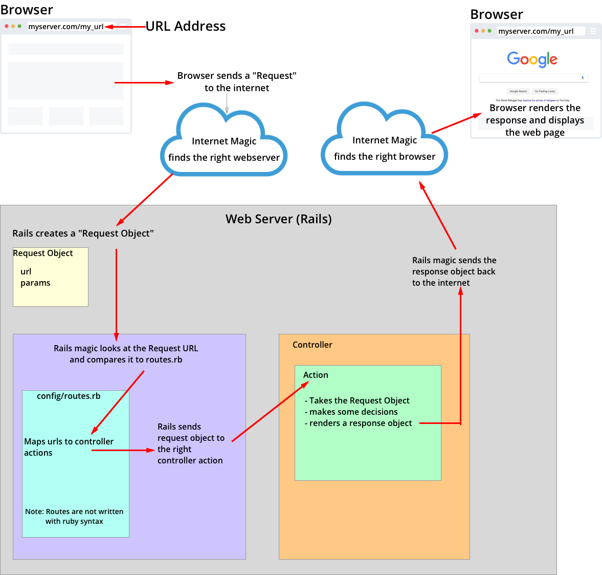

# README

This example repo explains the connection between routes and controllers in rails

It also is meant to serve as a quick intro to ruby for students so make sure to explain how both things work
while running through examples with students.

All of the following steps should *ideally* be done with the students copying you
1. Create a new app with `rails new`
1. Go into app/controllers/application_controller.rb and remove forgery protections
    * This will make it easier to curl posts and the like against the project
1. Starting at the top of app/controllers/example_controller.rb
    * Copy/type over methods into your example application
    * Create a route to point to that method as shown in config/routes.rb
    * Rinse and repeat for games_controller and/or search_controller until you get bored or run out of time
1. Encourage students to attempt to solve the problems shown in the completed_exercises_controller
